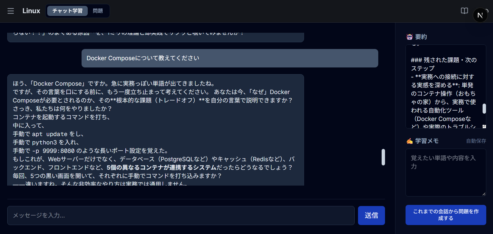
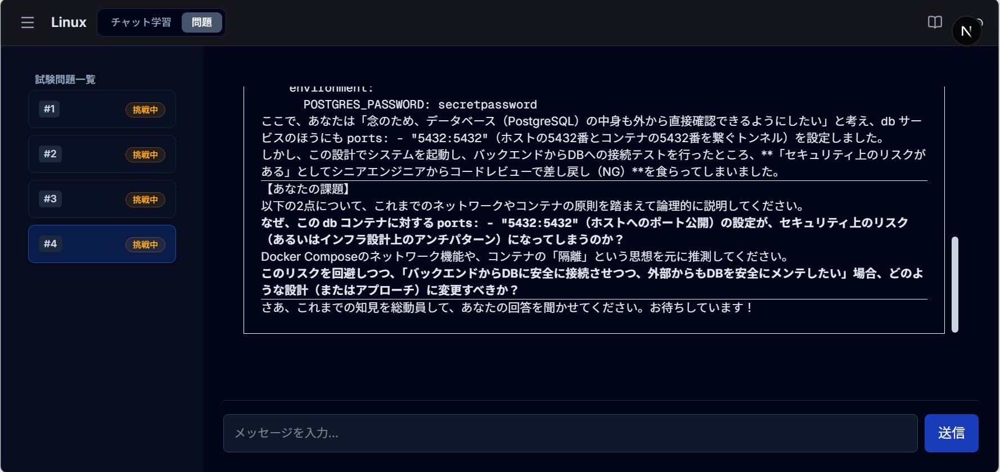
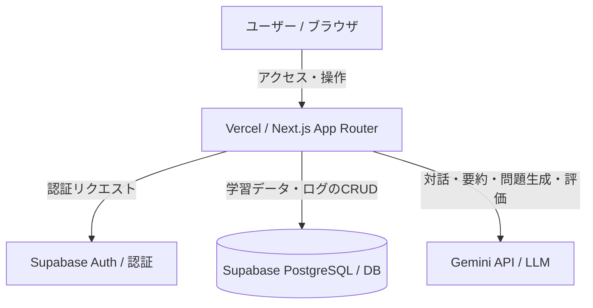

# socrates-ai-learning

> **単なる暗記で終わらせず、本質的な理解を深めるためのAI対話型学習ワークフローアプリ**

|          メイン対話画面           |      理解度テスト画面      |
| :-------------------------------: | :------------------------: |
|  |  |

🔗 **Demo:**
[https://knowledge-square-es78vvx02-678des-vercels-projects.vercel.app/](https://knowledge-square-git-main-678des-vercels-projects.vercel.app/)

> **🔑 お試し用デモアカウント**  
> 新規登録なしですぐにアプリをお試しいただけます。
>
> - **Email:** `guest@example.com`
> - **Password:** `guest1234`  
>   ※共有アカウントのため、機密情報等の入力はお控えください。

## 💡 開発背景と解決したい課題

### 開発背景

大学の授業や専門知識の学習において、内容の難しさから「テスト前に丸暗記して単位だけ取る」状態に陥りがちでした。単位は取れても知識が定着せず、真の理解を得られないことに強い問題意識を感じていました。

また、解決のために一般的なAIチャット（GeminiやChatGPT等）を利用していましたが、**チャット履歴の管理がしづらく、学習メモや過去の会話を踏まえた復習・問題演習への接続がスムーズに行えない**という課題がありました。

### 解決策

汎用的なAIチャットに頼るのではなく、**「科目ごとの整理 ➔ 会話による深掘り ➔ 自動要約・メモ化 ➔ 理解度テスト・自動評価」**という一連の学習サイクルをワンストップで回せる専用Webアプリを構築しました。

## ✨ 主な機能

- **ユーザー認証・プロファイル管理:** ログイン・会員登録機能（Supabase Auth）
- **科目（Subject）管理:** 学習したいテーマや大学の科目ごとにルームを整理・色分け管理
- **対話型学習ルーム (Gemini API):** 疑問点を掘り下げて「本質的理解」を促すAIチャット機能
- **会話の自動要約 & 学習メモ作成:** AIによる対話内容の要約と、ユーザー自身が書き込める学習のメモ
- **理解度確認テスト自動生成:** これまでの学習メモや会話履歴を踏まえた長文問題をAIが自動作成
- **AI解答評価システム:** ユーザーの記述式解答に対し、AIが概念を正しく理解できているかを厳密に判定・合格判定を出力

## 🛠 技術スタック

| カテゴリ               | 技術                                           |
| :--------------------- | :--------------------------------------------- |
| **フロントエンド**     | Next.js (App Router), TypeScript, Tailwind CSS |
| **バックエンド**       | Next.js Server Actions / API Routes            |
| **データベース・認証** | Supabase (PostgreSQL, Supabase Auth)           |
| **AI API**             | Google Gemini API                              |
| **インフラ**           | Vercel                                         |

## 💡 技術的なこだわり・工夫した点

- **ソクラテス式問答法のプロンプト設計:** AIがすぐに答えを教えるのではなく、ユーザーに問いかけて自発的な気づきを促すプロンプト（System Instruction）のチューニングを行いました。
- **会話ログの自動要約とコンテキスト最適化:** 一定のやり取りごとにバックグラウンドで会話の要約処理を実行する仕組みを構築しました。これにより、長い対話でもトークン消費を抑えつつ、文脈を維持した質の高い学習サポートを継続できるようにしました。

## 🏗 システム構成図 / アーキテクチャ



## 🔮 今後の展望 (Roadmap)

- [ ] テスト1問に対する合格不合格のStatus設定と、解答のための会話リセット機能
- [ ] マイページ機能
- [ ] ソフトデリートしたチャットの復元と、期限による完全削除
- [ ] 適切なルーティング

## 🚀 ローカル開発環境の構築

### 前提条件

- Node.js (v18.0.0以上)
- npm / pnpm / yarn

### インストール & 起動手順

1. **リポジトリのクローン**

   ```bash
   git clone https://github.com/678des/socrates-ai-learning.git
   cd socrates-ai-learning
   ```

2. **依存パッケージのインストール**

   ```bash
   npm install
   ```

3. **環境変数の設定**

   `.env.local.example` をコピーして `.env.local` を作成し、必要なAPIキーを設定してください。

   ```bash
   NEXT_PUBLIC_SUPABASE_URL=your_supabase_url
   NEXT_PUBLIC_SUPABASE_ANON_KEY=your_supabase_anon_key
   GEMINI_API_KEY=your_gemini_api_key
   ```

4. **開発サーバーの起動**
   ```bash
   npm run dev
   ```

ブラウザで http://localhost:3000/subjects にアクセスして確認できます。

## 📄 ライセンス

MIT License
